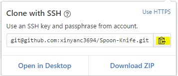

# GitHub Tutorial

_by Xinyan Chen_

---
## Git vs. GitHub
**1. Explain what each is**  
* Git is a version control that helps take snapshots of the code or different versions of the file.  
* Github helps store code in the cloud which makes it easier to collaborate on files and help visually track changes made to the code.  

**2. Explain the differences between the two**  
* The differences between Git and Github is that Git takes snapshots of the code and doesn't require Github, however, Github stores the codes in the "cloud" and require Git.  

---
## Initial Setup
**1. Explain how to make a GitHub account**  
* Go to [github.com](github.com)  
  
* Click **Sign up** to create a account  
  
* Include your personal informations  
    * Type in your username  
    * Type in your email address  
    * Type in your a password  

* Click **Create an account**  
  
* Select **Free** account type  
  
* Click **Finish sign up**  

**2. Explain SSH key setup**
* Go to [github.com](github.com)  
  
* Click profile icon at the top-right  
  
* Click **Setting**  
  
* Click **SSH and GPG keys** at the left sidebar  
  
* Press **New SSH key**  
  
* Type in _cloud9_ for **Title**  
* Open a new tab to [cloud9](c9.io)  
  
* Sign in with your gitHub account  
* Click the gear icon at the top-right  
  
* Go to **SSH keys** and copy and paste your SSH key into GitHub  
  
    * Key starts with `ssh-rsa`  
  
* Add SSH key  
* Open github-learning IDE in [cloud9](c9.io)  
  
* Type in `ssh -T git@github.com`  

---
## Repository Setup
**1. How to create a repository**  
* Go to [cloud9](c9.io)  
  
* Sign in with GitHub account  
* Open github-learning IDE in [cloud9](c9.io)  
  
* Change to workspace by typing in `cd ~/workspace` into the terminal  
* Make a new directory by typing in `mkdir first-repo` into the terminal  
* Change into first-repo by typing in `cd first-repo` into the terminal  
* Inside the first-repo type in `git init` into the terminal  
* Create a README file by typing in `touch README.md` into the terminal  
* Open README file by typing in `c9 README.md` into the terminal  
* Type in any message(s) into README file  
* Save the message(s) by pressing the keys _control_ and _z_  
* Add the message(s) into the repo by typing in `git add README.md` into the terminal  
* Take a screenshot of the message(s) by typing in `git commit -m ""` into the terminal  
    * Note: Type in a good message that helps you understand the change(s) made in README file  
* Open a new tab to [github.com](github.com)  
  
* Sign in with GitHub account  
* Press the plus icon  
  
* Click on **New Repository**  
  
* Type in _first-repo_ in **Repository name**  
  
* Press **Create repository**  
 
* Press **SSH** on the top and copy and paste `git remote add origin git@github.com:username/first-repo.git` and `git push -u origin master` one at a time into the terminal in git-learning IDE  
  
* Refresh the page to see changes  

---
## Workflow & Commands
**1. Workflow of Commands**  
* `git status`  
* `git add file.txt`  
* `git status`  
* `git commit -m "message"`  
* `git push`  

**2. Status**  
* `git status`  
* Helps check which file(s) have been edited since last commit  
**3. Add**  
* `git add file.txt`  
* Add file to the stage being committed  
**4. Commit**  
* `git commit -m "message"`  
* Takes “Snapshot” of files. The message(s) have to be in present-tense and it describes what is being modified.  
**5. Push**  
* `git push`  
* Update file folder  
    * Note: Can only push after commit  

---
# Extra Credit #

---
## Error Handling ##
**1. Uninitalize directory**  
* When you `git init` the wrong directory, type in `rm -rf .git` in the terminal  
**2. `git push` without destination**  
* When you `git push` the commit without a destination, type in `git add remote origin URL` first into the terminal then type in `git push -u origin master`  
    * Note: Replace URL with your own link that you want to push the commit to  
**3. Commit before add**  
* When you forgot to `git add file.txt` before `git commit -m "message"`, type in `git add file.txt` into the terminal  
    * Note: File.txt is your own file you want to add  
**4. Escape `git commit`**  
* When you type in `git commit` instead of `git commit -m "message"`, press _control_ and _x_ to return back to the terminal  
**5. Escape comment mode**  
* When you have trouble typing in commands and are stuck in the comment mode, press _control_ and _c_  
**6. `git add` deleted files**  
* When you want to `git add` deleted files, type in `git add --all` into the terminal  

---
## Collaboration ##
**1. Fork and `clone`**  
* Go to a link you want to fork in GitHub  
* Sign in with GitHub account  
* Press **Fork**  
  
* Press **Clone or download**  
  
* Make sure you clone with SSH and copy the SSH key  
  
* Go to [cloud9](c9.io)  
  
* Sign in with GitHub account  
* Open github-learning IDE in [cloud9](c9.io)  
  
* Type in `git clone` and paste the SSH key  
    * Note: Make sure you are in the workspace directory  
**2. Pull requests and `pull`**
* * Go to a link you want to fork in GitHub  
* Sign in with GitHub account  
* Press **Fork**  
  
* Press **Clone or download**  
  
* Make sure you clone with SSH and copy the SSH key  
  
* Go to [cloud9](c9.io)  
  
* Sign in with GitHub account  
* Open github-learning IDE in [cloud9](c9.io)  
  
* Type in `git clone` and paste the SSH key  
    * Note: Make sure you are in the workspace directory  
* Make changes to the local repo  
* `git add file.txt` the file  
* `git commit -m "message"`  
* `git push`  
* Go to [github.com](github.com)  
  
* Press **New pull request**  
  
* Pull request approve  
* Original owner use `git pull` to see what changes you make to the repo  